# WiGa — William's Games 🎮

A small playground of browser games built **to learn coding and have fun — using AI coding agents** (Claude Code + the Superpowers plugin) as collaborators.

Every game is static HTML with a shared local high-score helper: zero build step, no dependencies to install. Open in any modern browser and play.

The site is split into four sections, all reachable from the top nav on every chrome page:

- **[Single Player](./index.html)** — the main games catalog (10 games today)
- **[Multi-Player](./multiplayer.html)** — pass-and-play games for two on one screen
- **[High Scores](./high-scores.html)** — best runs saved on this device, one tile per game
- **[Donate](./donate.html)** — a thank-you page with a coffee-tip link

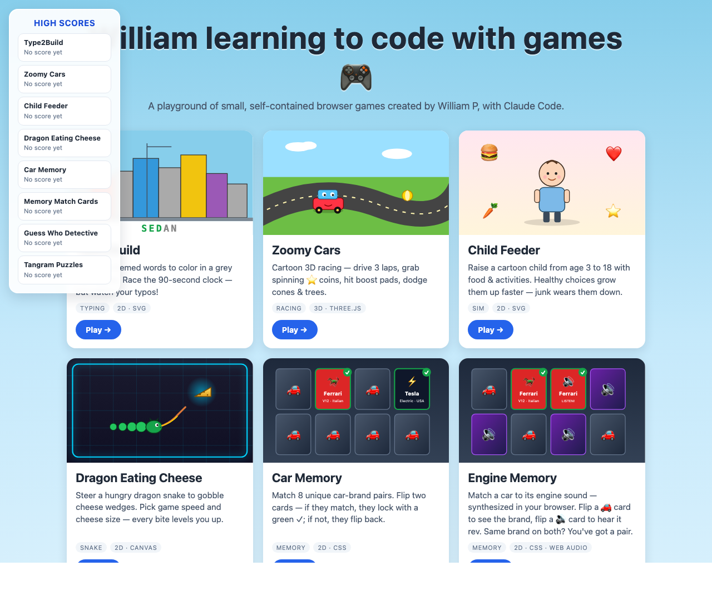

## Games

| Game | Preview | File | Style |
| --- | --- | --- | --- |
| [Type2Build](#type2build) | 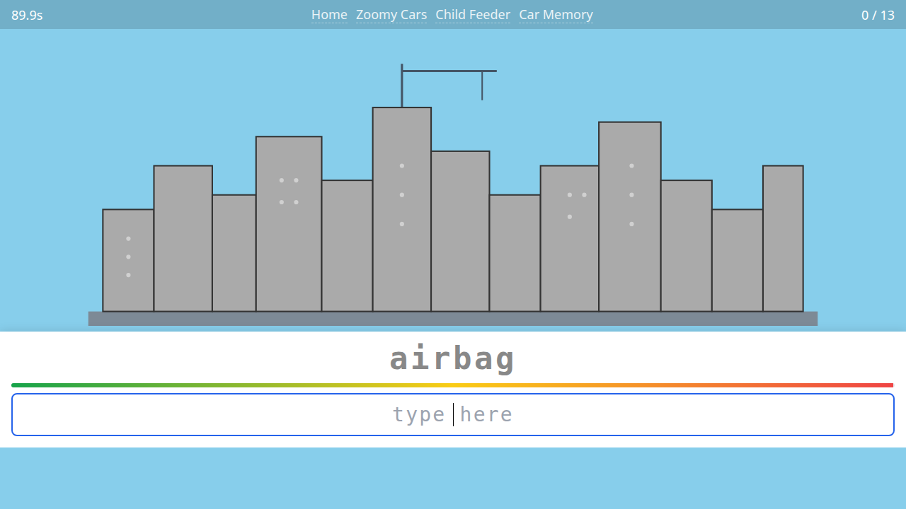 | [`games/type2build.html`](./games/type2build.html) | 2D · SVG |
| [Zoomy Cars](#zoomy-cars) | 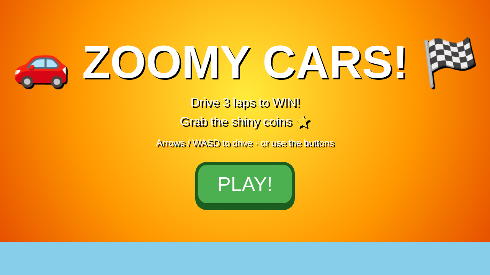 | [`games/zoomy-car.html`](./games/zoomy-car.html) | 3D · Three.js |
| [Child Feeder](#child-feeder) | 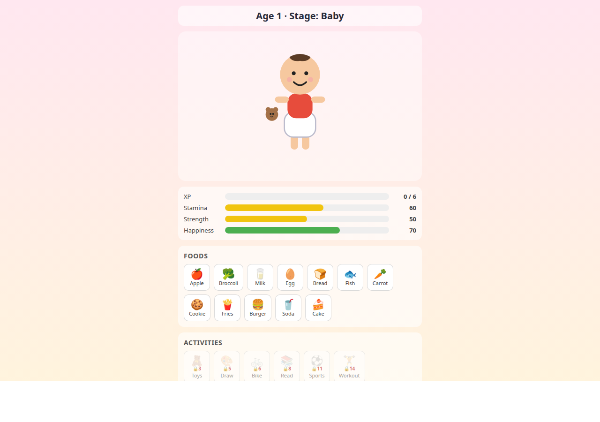 | [`games/child-feeder.html`](./games/child-feeder.html) | 2D · SVG |
| [Dragon Eating Cheese](#dragon-eating-cheese) | 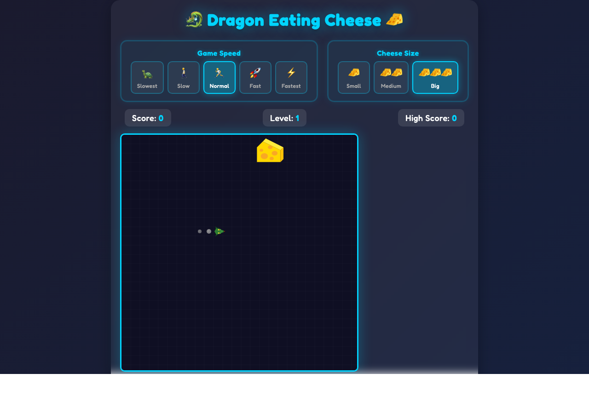 | [`games/dragon.html`](./games/dragon.html) | 2D · Canvas |
| [Car Memory](#car-memory) | 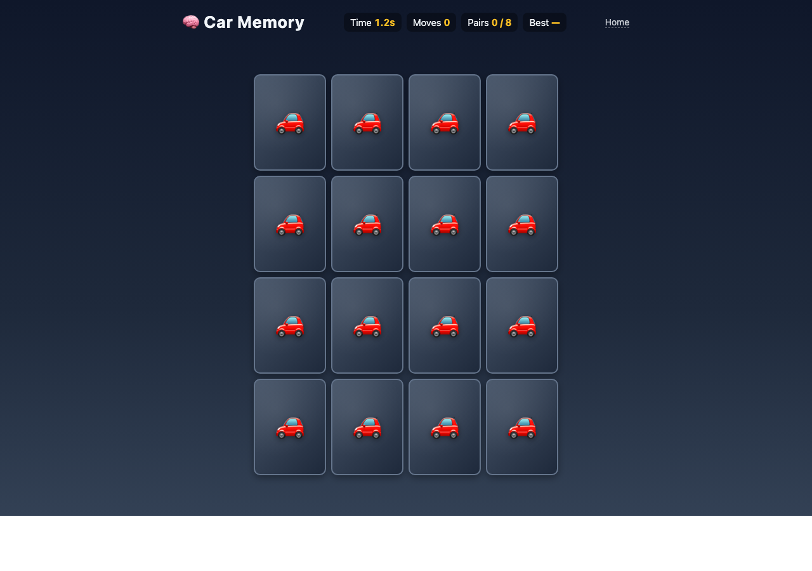 | [`games/car-memory.html`](./games/car-memory.html) | 2D · CSS |
| [Engine Memory](#engine-memory) | 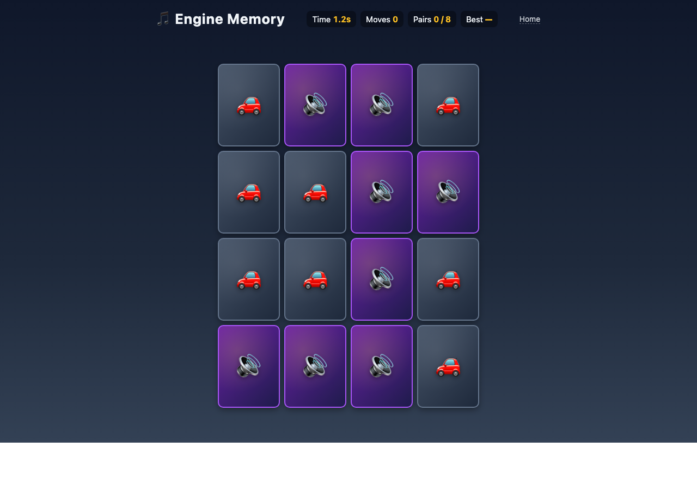 | [`games/engine-memory.html`](./games/engine-memory.html) | 2D · CSS · Web Audio |
| [Pit Stop Crew](#pit-stop-crew) | 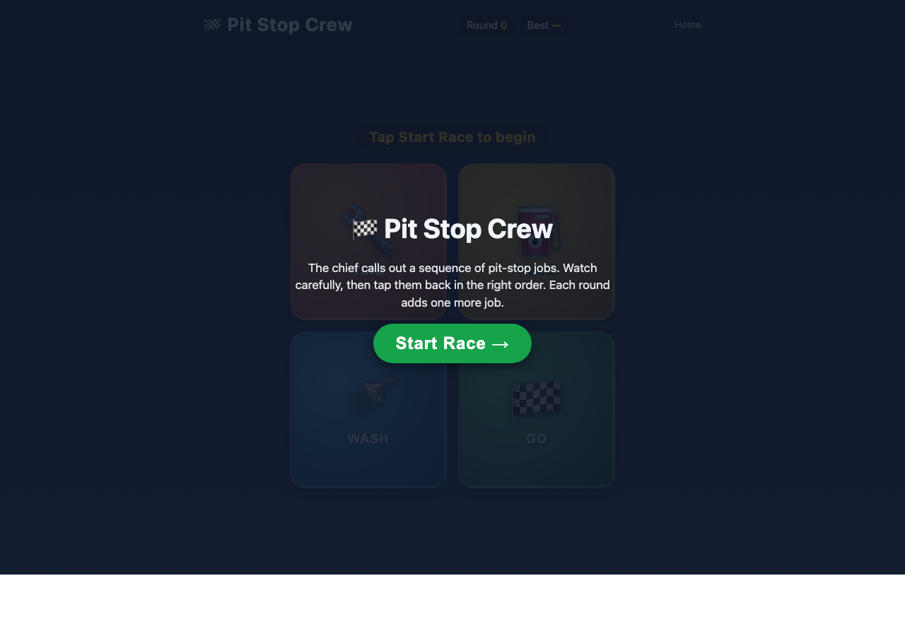 | [`games/pit-stop-crew.html`](./games/pit-stop-crew.html) | 2D · CSS · Web Audio |
| [Memory Match Cards](#memory-match-cards) | 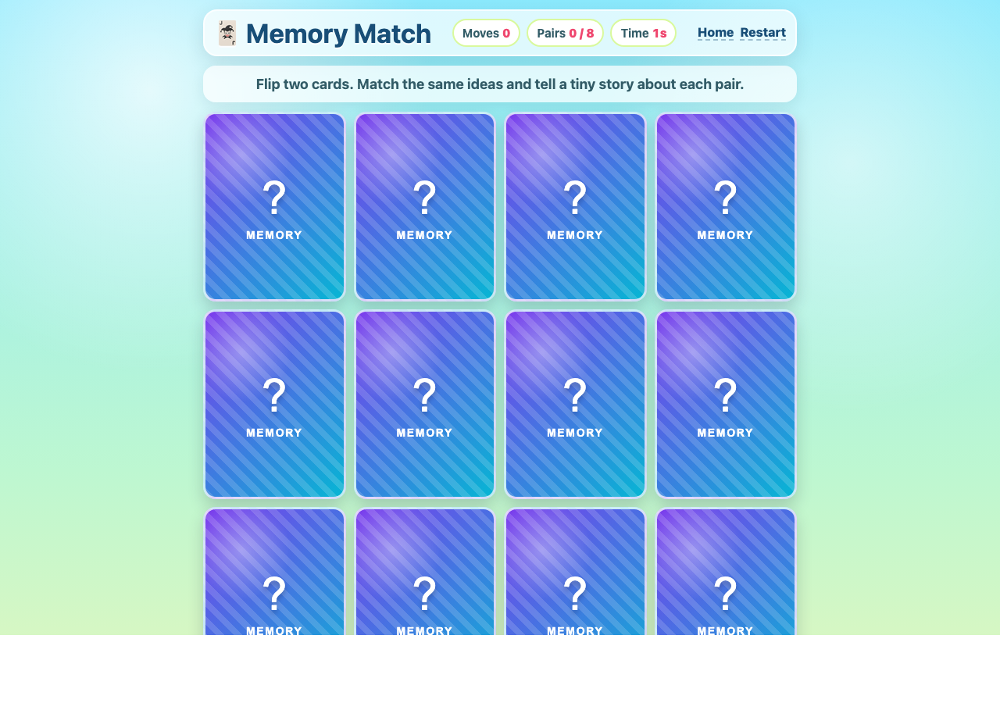 | [`games/memory-match.html`](./games/memory-match.html) | 2D · CSS |
| [Guess Who Detective](#guess-who-detective) | 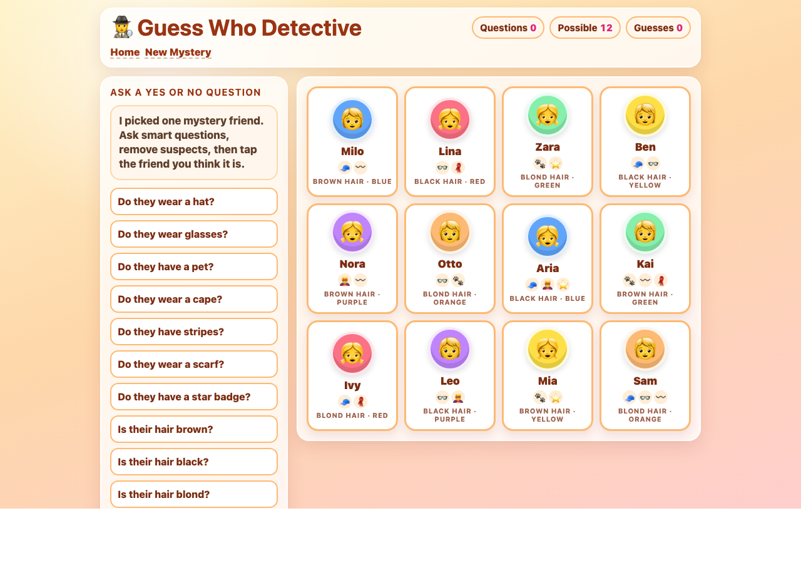 | [`games/guess-who.html`](./games/guess-who.html) | 2D · CSS |
| [Tangram Puzzles](#tangram-puzzles) | 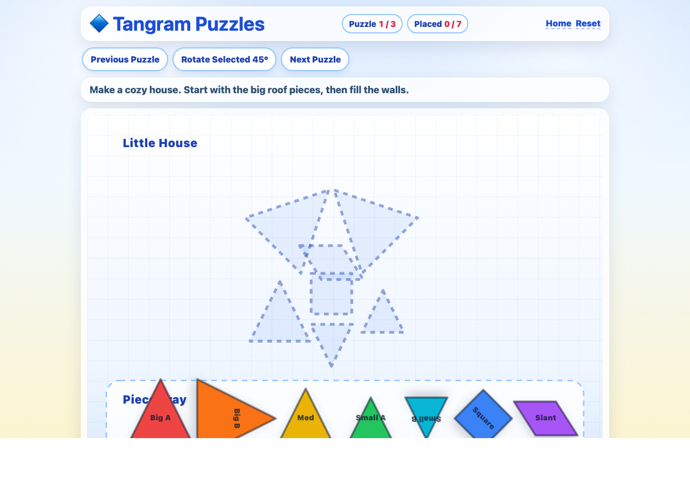 | [`games/tangram-puzzles.html`](./games/tangram-puzzles.html) | 2D · SVG |

---

### Type2Build


Type car-themed words to color in a grey city skyline. Each word you finish lights up a random section in a random color. Race the 90-second clock to fill all 13 sections of the city — but watch out: every typo costs 2 seconds and rolls your input back to the last correct letter.

**Controls:** keyboard (mobile: tap the input to focus, then use the virtual keyboard).

**Highlights**
- 13 city sections, randomized fill order, saturated color palette
- 90-second global timer + per-word timer
- Mistype penalty: red flash, rollback, −2s on the global clock
- End screen with stats — time used, words completed, typos, accuracy
- "Play Again" resets the round

▶ [Open `games/type2build.html`](./games/type2build.html)

---

### Zoomy Cars


A cartoon 3D racing game. Drive a googly-eyed car around a looped track, grab spinning coins, hit boost pads for speed bursts, and try not to crash into cones, AI racers, or trees. Built with Three.js loaded from a CDN.

**Controls**
- Desktop: arrow keys or **WASD** to drive, **R** to repair
- Mobile/tablet: on-screen buttons (gas, brake, left, right) + REPAIR

**Highlights**
- 3 laps, 3 AI rivals, finish-line confetti + fanfare
- Spinning ⭐ coins, worth **2×** while a boost is active
- Orange boost pads → **+3 ⭐** instantly, speed surge, flame trail
- Collisions: knock traffic cones flying, bump AI cars, hard crash into trees (with bounce + spin-out)
- 5-heart HP system — AI bumps cost 1 ❤️, tree crashes cost 2 ❤️
- **Repair shop**: 1 ⭐ = 1 ❤️ (press R or tap REPAIR)
- At 0 HP the car limps along at half speed until you repair it

▶ [Open `games/zoomy-car.html`](./games/zoomy-car.html)

---

### Child Feeder


Raise a cartoon child from age 1 to 18. Pick foods (healthy or junk), pick activities (age-gated), and put the child to sleep when they cry. Healthy choices grow them up faster; junk wears them down over time.

**Controls:** mouse / touch — tap food, activity, or Sleep buttons.

**Highlights**
- 12 foods and 6 activities, with stat-specific effects
- 4 hand-drawn SVG stages: **Baby** (1–3), **Kid** (4–8), **Boy/Girl** (9–12), **Teen** (13–18)
- Per-game randomization: gender (boy/girl), outfit color (5 themes), hair color (4 shades) — character stays consistent across all 4 stages
- Each new age adds a visual detail: pacifier, booties, cap, backpack, glasses, scarf, watch, necklace, phone, sunglasses, chain, and a 🎓 graduation cap at 18
- XP-bar progression: 6 healthy actions → +1 year
- Crying state: only Sleep is available until happiness recovers
- 4 ending variants based on the child's dominant final stat

▶ [Open `games/child-feeder.html`](./games/child-feeder.html)

---

### Dragon Eating Cheese


Steer a hungry dragon snake around the arena to gobble cheese wedges, collect bonus stars, level up, and avoid crashing into walls or yourself.

**Controls:** arrow keys / WASD on desktop, on-screen controls on touch devices.

**Highlights**
- 5 speed presets (slowest → fastest) and 3 cheese sizes (small / medium / big)
- Level up every 50 points; each level shaves 10ms off the tick speed (down to a 50ms floor)
- Bonus star food appears with a timed glow — grab it for extra points
- Game-over animation and local high scores

▶ [Open `games/dragon.html`](./games/dragon.html)

---

### Car Memory


Memorize first, then match. Every round opens with a 5-second peek that reveals all 16 cards before flipping them face-down. Tap two cards: if the brands match, both lock with a green ✓ — if not, they shake and flip back. Find all 8 pairs to win.

**Controls:** mouse / touch — tap any face-down card to reveal. Tap anywhere during the peek to skip the countdown and start immediately.

**Highlights**
- 8 themed pairs: Ferrari, Tesla, Porsche, Lamborghini, BMW, Mercedes, Toyota, Ford
- Each card shows brand, logo, and 3 features on a brand-colored face
- 5-second peek countdown at the start of every round
- Live header stats: **Time**, **Moves**, **Pairs**, and **Best** score (with player name)
- Snappy 3D card-flip animation; cards shake on a wrong pair
- End screen with time, moves, score, and "Play Again"

▶ [Open `games/car-memory.html`](./games/car-memory.html)

---

### Engine Memory


A car-themed memory match aimed at younger players (about 7+) where every pair is **one visual card + one sound card** of the same brand. Tap a 🚗 to see a car, tap a 🔊 to hear its engine — match both for the same brand to lock the pair.

The engine sounds are **synthesized live in your browser via the Web Audio API** — no audio files, no downloads. Each brand gets its own voice: a screaming Ferrari V12, a whirring Tesla, a rumbling Mustang, a snarling Lamborghini, and so on. Sounds work fully offline.

**Controls:** mouse / touch — tap any face-down card to reveal. Tap anywhere during the peek to skip the countdown.

**Highlights**
- 16 cards in a 4×4 grid: 8 visual cards (🚗 back) + 8 sound cards (🔊 back) — distinct backs let kids plan
- 8 unique procedural engine sounds built from oscillator stacks + filtered noise, with rev-up / rev-down envelopes
- Match rule: a 🚗 and a 🔊 of the *same brand* — two of the same kind can never match
- 3-second peek countdown shows every brand on every card before play begins
- Live header stats: **Time**, **Moves**, **Pairs**, and **Best** score (with player name)
- Speaker icon pulses while a sound is playing, snappy 3D card flip, shake on a wrong pair
- End screen with time, moves, score, and "Play Again"

▶ [Open `games/engine-memory.html`](./games/engine-memory.html)

---

### Pit Stop Crew


A car-themed **sequence-memory** game (Simon-style) aimed at younger players (about 7+). The pit chief flashes a sequence of pit-stop jobs on four colored buttons — 🔧 Tire, ⛽ Fuel, 🚿 Wash, 🏁 Go — and you tap them back in the same order. Each round adds one more step. How long can you remember?

A different brain workout from the spatial memory games on this page: instead of *where* the matching card is, you have to recall the *order* the chief called the jobs. Speed ramps up as you progress, but never past a fair floor.

**Controls:** mouse / touch — tap the colored buttons in the same order the chief flashes them.

**Highlights**
- 4 chunky pit-crew buttons with distinct gradient colors and unique tones (a C major arpeggio: C4, E4, G4, C5)
- Sequence length grows by one every round; flash speed gradually accelerates from 600ms down to 320ms over 14 rounds
- Tones synthesized live via Web Audio API — works fully offline, zero asset files
- Visual + audio feedback on every tap (button glows, plays its tone), descending error bleat on a wrong tap
- Live header stats: **Round** (current attempt) and **Best** (top round saved with player name)
- Reach round 8 → "Pit Crew Pro!" headline on the end screen

▶ [Open `games/pit-stop-crew.html`](./games/pit-stop-crew.html)

---

### Memory Match Cards


A playful 4x4 memory game with 8 creative idea pairs. Every round opens with a 3-second peek that reveals all 16 cards face-up so you can map out the pairs. Then the deck flips face-down and the matching begins — find dragons, rockets, robots, castles, music, puzzles, paint, and stars.

**Controls:** mouse / touch — tap any face-down card to reveal. Tap anywhere during the peek to skip the countdown and start immediately.

**Highlights**
- 8 idea pairs focused on imagination and memory
- 3-second peek countdown at the start of every round
- Moves, pair count, and live timer
- Matched pairs reveal a tiny creative story prompt
- 3D card-flip animation, shake on wrong pairs, end screen with stats

▶ [Open `games/memory-match.html`](./games/memory-match.html)

---

### Guess Who Detective


A single-player deduction game inspired by yes/no mystery guessing. The game secretly picks one friend; ask yes/no questions about hats, glasses, capes, stripes, scarves, star badges, pets, hair color, and shirt color to narrow down the suspects before making your final guess.

**Controls:** mouse / touch — tap question buttons, then tap a remaining suspect to guess.

**Highlights**
- 12 cartoon suspects with visible traits
- 12 yes/no questions covering accessories, clothing, hair, and pets
- Each "yes" or "no" automatically crosses out impossible suspects
- Tracks questions asked, guesses made, and remaining possibilities
- Encourages logic, observation, and careful elimination

▶ [Open `games/guess-who.html`](./games/guess-who.html)

---

### Tangram Puzzles


Drag, rotate, and snap seven geometric pieces onto dotted outlines to complete kid-friendly tangram puzzles.

**Controls:** mouse / touch — drag pieces; tap a piece and use **Rotate Selected 45°** to turn it.

**Highlights**
- 3 puzzles: Little House, Space Rocket, Clever Cat
- 7 colorful SVG tangram pieces
- Snap-to-place behavior when both position and rotation match
- Builds spatial reasoning, patience, and problem solving

▶ [Open `games/tangram-puzzles.html`](./games/tangram-puzzles.html)

---

## Multi-Player Games

| Game | File | Style |
| --- | --- | --- |
| [Memory Match Duel](#memory-match-duel) | [`games/memory-match-duel.html`](./games/memory-match-duel.html) | 2D · CSS · Pass-and-Play |

---

### Memory Match Duel

A two-player twist on the Memory Match grid: same 4×4 board, same 8 idea pairs, but you take turns and whoever finds more pairs wins.

**Controls:** mouse / touch — both players share one device. Hand it back and forth on each turn switch.

**Highlights**
- Two name inputs at the start (defaults: "Player 1", "Player 2"); each player gets a color (mint vs peach)
- Score bar with a glowing "Your turn" pill shows whose move it is
- Match → keep the turn and tint the locked cards in your color; miss → flip back and pass the device
- 3-second peek at the start of every round so both players can plan
- Confetti shower on a win, special "It's a tie!" message on 4–4
- No leaderboard — pass-and-play results aren't saved as personal bests

▶ [Open `games/memory-match-duel.html`](./games/memory-match-duel.html)

---

## Local High Scores

All games save their top local scores with `localStorage` through [`games/high-scores.js`](./games/high-scores.js). When a run qualifies for the top 5, the browser asks for the player name and stores the score on that browser/device only. The catalog page shows the best saved score for every game.

---

## Built With Agents

This repo is written collaboratively with AI coding agents — designs, specs, and implementation plans live under [`docs/superpowers/`](./docs/superpowers/). The goal is twofold: make playable little things, and learn how far agents can take an idea from "make me a typing game" to a finished, testable feature.

## Run Locally

No build step — just open the HTML files:

```sh
open index.html                        # game catalog (start here)
open multiplayer.html                  # 2-player games
open high-scores.html                  # leaderboards
open donate.html                       # thank-you page

open games/type2build.html             # typing game
open games/zoomy-car.html              # racing game
open games/child-feeder.html           # child-feeder game
open games/dragon.html                 # dragon snake game
open games/car-memory.html             # memory game
open games/engine-memory.html          # engine-sound memory game
open games/pit-stop-crew.html          # pit-crew sequence memory game
open games/memory-match.html           # creative memory game
open games/guess-who.html              # deduction game
open games/tangram-puzzles.html        # tangram puzzle game
open games/memory-match-duel.html      # 2-player memory match
```

Or serve the directory with any static file server, e.g.:

```sh
python3 -m http.server
```
